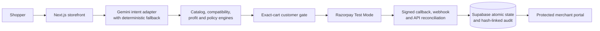

# CartPilot

[](https://github.com/navdeep1610/cartpilot/actions/workflows/ci.yml)

CartPilot is a bounded AI skincare sales agent for Razorpay AI Buildathon Track 01 — AI Growth & Agentic Commerce.

Live demo: <https://cartpilot-gold.vercel.app/>

It converts a shopper's natural-language goal into a catalog-backed routine, evaluates compatible bundles, cross-sells and approved discounts with deterministic merchant rules, asks the shopper to confirm the exact total, and uses Razorpay Test Mode for checkout.

## The Track 01 claim

> CartPilot grows estimated merchant contribution profit through relevant routine completion while keeping every money action explainable, bounded, customer-gated and traceable.

CartPilot follows the challenge's revenue-growth route. Agent-to-agent protocol support and campaign orchestration are optional extensions, not claims of the current submission.

## What is working

- Forty-product, seventy-four-variant merchant catalog with customer-safe projection.
- Natural-language intent extraction with a deterministic fallback when Gemini is unavailable.
- Bounded multi-turn follow-ups with visible agent actions, authority labels and safe retry.
- Catalog-backed routine recommendations and human-readable reasons.
- Deterministic baseline, bundle, cross-sell, substitute and bounded-discount candidates.
- Fail-closed compatibility, bundle-component inventory, customer-exclusion and discount-policy guards.
- Runtime manifest and offer-decision schema validation before commercial results are returned.
- Integer-paise profit calculations and merchant-controlled margin rules.
- Exact-cart and exact-total confirmation before order creation.
- First-checkout personal-details prompt that returns the shopper to the unchanged cart after saving.
- Razorpay Orders and Standard Checkout in Test Mode.
- Server-side callback and webhook signature verification.
- Fulfilment blocked until captured payment evidence is reconciled.
- Supabase-backed customer profiles, customer order history, merchant orders and payment events.
- Captured purchases move from the cart into the shopper's private **My orders** panel; failed or unfinished payments retain the cart.
- Protected merchant portal using Supabase Auth and an allowlisted merchant email.

## Current upgrade programme

The baseline application is implemented and builds successfully. A September 2026 readiness audit identified the remaining work needed before the project should be presented as hackathon-complete.

1. Hackathon story and governance freeze — complete in this release.
2. Commercial-policy correctness and catalog validation — complete in this release.
3. Transactional payment and webhook reliability — complete in this release.
4. Complete intent-to-fulfilment audit trail — complete in this release.
5. Failure-first customer recovery flow — complete in this release.
6. Thirty-five-scenario growth evaluation and merchant evidence — complete in this release.
7. Agentic interaction polish — complete in this release.
8. CI, deployment and submission package — engineering complete; account-owner evidence remains.

The live requirement matrix and exit criteria are in [HACKATHON_REQUIREMENTS.md](./HACKATHON_REQUIREMENTS.md). Detailed product and engineering contracts remain in [PROJECT_PLAN.md](./PROJECT_PLAN.md) and [IMPLEMENTATION_SPEC.md](./IMPLEMENTATION_SPEC.md).

## Trust boundaries

- The LLM may interpret the shopper's words; it cannot choose prices, discounts, products, orders or payment states.
- Customer-visible prices come from the server catalog.
- The customer must approve the exact revalidated total.
- Razorpay handles payment credentials; CartPilot must never store card numbers, CVVs, PINs, passwords or OTPs.
- A browser callback proves authenticity but does not authorize fulfilment by itself.
- Live Razorpay keys are rejected by the application.
- This is catalog guidance for a demonstration, not medical advice.

## Run locally

Requirements: Node.js 24.x and pnpm 11.x.

```bash
pnpm install
cp .env.example .env.local
pnpm dev
```

Configure private values in `.env.local`; never commit that file. See [DEPLOYMENT_GUIDE.md](./DEPLOYMENT_GUIDE.md) for Supabase, Gemini, Razorpay Test Mode and merchant-login setup.

## Quality checks

```bash
pnpm lint
pnpm typecheck
pnpm test
pnpm test:evaluation
pnpm validate:release
pnpm audit:dependencies
pnpm build
pnpm test:e2e
```

The [CI/CD pipeline](./.github/workflows/ci.yml) runs the same release gate on pull requests and `main`, including JSON Schema and manifest validation, secret/live-key scanning, all unit and integration tests, the 35-scenario evaluation, a high-severity production dependency audit, the production build, and desktop/mobile browser journeys. After a successful push to `main`, it waits for Vercel to finish deploying that exact commit and smoke-checks the live website. The badge at the top of this README shows the latest `main` pipeline result and opens its GitHub Actions history.

The Phase 6 implementation adds a deterministic replay of all 35 checked-in scenarios, a merchant-only growth dashboard, complete JSON export and an honest exception report. The current frozen result is 31/35 expected outcomes matched, 10/10 safety cases matched and ₹1,937.86 estimated incremental contribution profit across eight comparable growth cases. These are synthetic estimates, not realized revenue or conversion lift. See [`evaluation/GROWTH_EVALUATION_REPORT.md`](evaluation/GROWTH_EVALUATION_REPORT.md) and run `pnpm test:evaluation` to reproduce the acceptance suite.

Phase 7 adds bounded shopper follow-ups, visible agent activity, explicit AI-versus-rule authority labels, provider fallback and safe recommendation retry. The activity record reports actions and evidence; it does not expose or claim private model reasoning.

Phase 8 adds the automated release workflow, contract and secret validation, desktop/mobile browser acceptance tests, stable deployment instructions, a five-minute demo script, and an evidence checklist. See [the demo script](submission/DEMO_SCRIPT.md) and [release checklist](submission/RELEASE_CHECKLIST.md).

## Architecture



The LLM is advisory. It cannot select catalog eligibility, set a price or discount, create an order, change payment state, or authorize fulfilment. Those actions are performed by versioned deterministic code and server-verified payment evidence.

## Honest limitations

- The catalog, skincare relationships, costs, policies and reported uplift are synthetic demo inputs and are not approved for production or medical use.
- Four of the 35 frozen scenarios remain documented exceptions; the headline result does not omit them.
- Razorpay is Test Mode only. No real-money use is authorized.
- ACP, AP2, UAP, x402, autonomous purchasing and campaign orchestration are not implemented claims.
- A complete submission still requires the account owner to verify the stable webhook, record one successful and one failed/retried Test payment, confirm event eligibility and deadline, and upload the demo video.

## Demo path

1. Describe a skin type, concern and budget.
2. Review the catalog-backed routine.
3. Add products and inspect the profit-aware offer.
4. Choose the offer or keep the baseline cart.
5. Confirm the exact total.
6. Save personal details when prompted and return to the same cart.
7. Complete Razorpay Test Checkout.
8. Confirm that the purchased products leave the cart and appear under **My orders**.
9. Review the resulting payment evidence in the protected merchant portal.

The repository engineering package is complete only when CI passes. The hackathon submission is complete only after every account-owner item in [the release checklist](submission/RELEASE_CHECKLIST.md), including successful and failed-payment evidence through the stable webhook, is checked.
